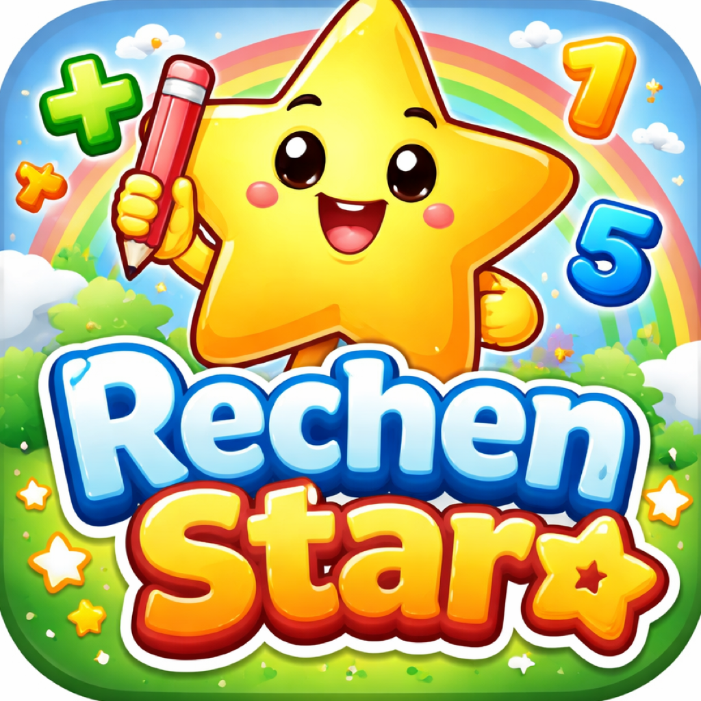

  

# RechenStar Web

Die Web-Version von RechenStar — kostenlos spielbar unter **[rechenstar.ch](https://rechenstar.ch)**.

RechenStar macht Mathe zum Abenteuer! Ob Plus, Minus oder Mal — RechenStar begleitet Grundschulkinder Schritt fuer Schritt durch die Welt der Zahlen.

## Original iOS App

Die native iOS-App mit allen Features findest du auf GitHub: [thomhug/RechenStar](https://github.com/thomhug/RechenStar)

## Lizenz

Copyright 2026 anbeda AG. Alle Rechte vorbehalten.
